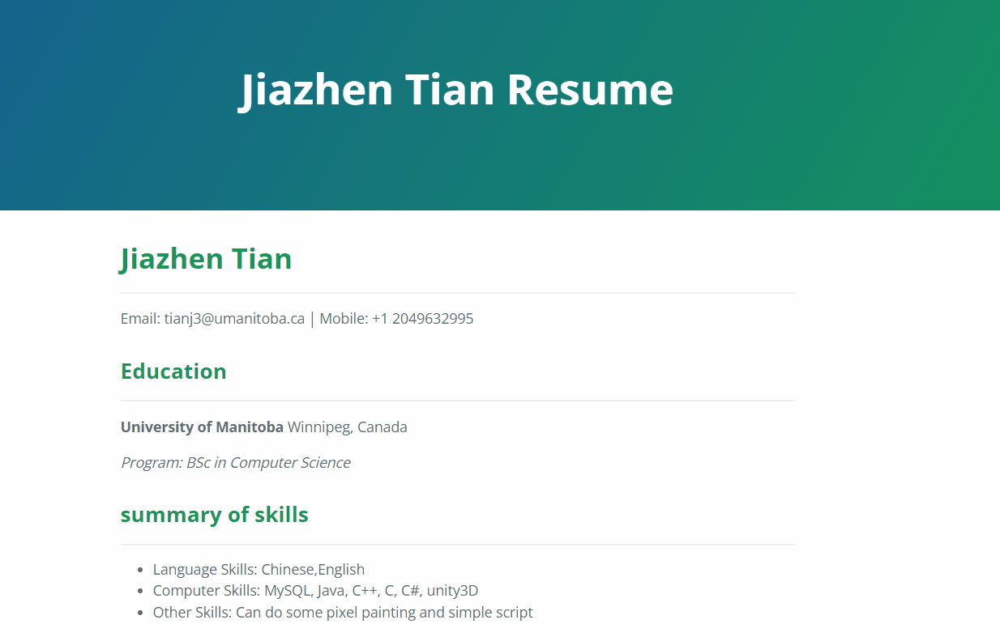

# How to create static websites with resume and host it on GitHub Pages 
---

## Purpose:
---
1. Guide the reader how to create a Static website with resume included by using Jekyll, and host static website on GitHub pages.
2. Explaining how do the steps correspond to Andrew Etter's book _Modern Technical Writing_

## Content:
---
- [Purpose:](#purpose)
- [Content:](#content)
- [Prerequisites:](#prerequisites)
- [Instructions:](#instructions)  
      - [**Step 1:** Create a new repository](#step-1-create-a-new-repository)  
      - [**Step 2:** Create, and Edit Static website](#step-2-create-and-edit-static-website)  
      - [**Step 3:** Hosting on GitHub Pages](#step-3-hosting-on-github-pages)  
      - [**Step 4:** Local View](#step-4-local-view)

- [Steps relate to general principles of current Technical Writing:](#steps-relate-to-general-principles-of-current-technical-writing)
- [More Resources:](#more-resources)
- [Authors and Acknowledgments:](#authors-and-acknowledgments)
- [FAQs](#faqs)

# Prerequisites:
---
 1. A resume formatted in Markdown  
If you don't know how to format resume by using Markdown. you can see Markdown in [More Resources](#more-resources)

 2. All tools and software used in this guide 
    - [GitHub Account](https://github.com/join)
    - [Git](https://git-scm.com/downloads)
    - [Jekyll](https://jekyllrb.com/docs/installation/)
    - [Ruby (Jekyll in windows)](https://jekyllrb.com/docs/installation/windows/)

# Instructions:
---
This is the resume page I created through the following steps.


#### **Step 1:** Create a new repository
1. Click on the `+` on the main page and select new repository.
2. Make basic settings
    - Enter the repository name `youraccountName.github.io`
    - Set Public (that Anyone can see this repository)
    - Click Create repository

#### **Step 2:** Create, and Edit Static website
1. **Create**
  - Run the following commands（You can replace it with the name you want to change）to Create  Static Site default files in the current directory  
    ``` 
    jekyll new NAME
    ```

2. **Edit** 
    Since we want to display the resume file directly on the homepage, so we have to replace the origin theme.
    
    1. Delete the `index.md` file from the original folder and rename the `readme.md` to `index.md`
    2. Select a favorite theme from the [GitHub page Supported themes](https://pages.github.com/themes/) and open it.
    3. Open README in the theme page , modify the `config.yml` according to the readme instructions.
    4. my resume uses the Cayman theme, so remove all things in  `_config.yml` and add following line: 
    
         ```
         remote_theme: pages-themes/cayman@v0.2.0
         plugins:
         - jekyll-remote-theme
         ```
    5. The next step is to modify the Gemfile, open it      
    6. use # comment out the line start with `"gem jekyll"`  
    7. remove # from gem `gem "github-pages", group: :jekyll_plugins`, save and exit.
    8. Add the following setting to the beginning of `index.md`
         ```
         ---
         layout: default
         title: yourneme resume
         ---
         ```

#### **Step 3:** Hosting on GitHub Pages
Open a terminal in the Static Sites folder and enter the following command

1. set a repository 

    ```
    git init
    ```
2. We need to check out the gh-pages branch so run

    ```
    git checkout -b gh-pages
    ```

4. go to commit all files to repository

    ```
    git add .
    ```
    ```
    git commit -m "initial commit"
    ```
5. Connecting local repository to online repository
    ```
    git remote add origin {link}
    ```
6. choose the bash
    ```
    git branch -M main
    ```
7. push all thing in your local repository
    ```
    git push -u origin main
    ```

8. Click our repository's `setting`, then select the `page` option
9. Select `main` and `root` in the `branch` and save.  

Then wait for a while and we will get the link to the GitHub page, so we will successfully create a static website with a resume and host the website on the GitHub page.

#### **Step 4:** Local View
 Open terminal in static site file and run the following commands
 1. Run ```gem install bundler``` to install bundler
 2. Run ```bundle exec jekyll serve``` 
- If you get error in this step `cannot load such file -- webrick (LoadError)` you can run following line to deal it
    ```
    bundle add webrick
    ```
    When we open the obtained link in the browser, we can see the web page and we can modify the index.md to change the web page content.(Note that you have to remember to upload after modifying)


# Steps relate to general principles of current Technical Writing:
---
1. **Use Lightweight Markup**. Firstly, we used markdown, a lightweight language described in the book. Markdown is a very simple lightweight language that users can master in a short time, and according to the Etter's book, writing XML is very hard, lightweight is to make it easier to produce well-formed XML. So we chose to use markdown to format the resume, which makes it very easy to update it. In our case, Instructions step 2 we only need to make very few changes to `resume.md` to get the file to display in its entirety on the GitHub page, and we don't need to learn XML or HTML. And lightweight markup languages are more portable and able to function on all operating systems, therefore we don't need to worry about the compatibility of the system

2. **Make Static Websites**.  Secondly, according to the Etter's book, static sites are high-speed, simplicity, and portability,Therefore  In this guide, Instructions step 4 we've taken a static website and tested it locally, which is very easy and convenient, and our changes are also shown in real time. After we change the index content in the editor, we can refresh it to see the updated content on our local site. At the same time, because there is no database, it will provide high security.

3. **Use Distributed Version Control**. Finally, We chose GitHub to host our resume because GitHub is built on top of git, which is a distributed version control system. According to Etter's book, "distributed systems have better performance, support offline work, and have the advantage of multiple people working on the same file." If this is a multi-person project, so it is very convenient to update the resume file. We just need to make the changes locally, submit the push and the update will be done, and there is no need to go with others to transfer files, because the latest files are on GitHub.

# More Resources:
---
1. [Markdown tutorial](https://www.markdowntutorial.com/)
2. [Andrew Etter's book](https://www.amazon.ca/Modern-Technical-Writing-Introduction-Documentation-ebook/dp/B01A2QL9SS)
3. [Mike Dane's Jekyll tutorial](https://www.youtube.com/playlist?list=PLLAZ4kZ9dFpOPV5C5Ay0pHaa0RJFhcmcB)
# Authors and Acknowledgments:
---
- Jiazhen Tian
- Group members
  - Bradley Cook 
  - Edmund Wong 
  - KUSHAAN KASHYAP 
- Andrew Etter
- Mike Dane(**Jekyll tutorial**)- 

# FAQs
---
**Q:** Why does my page look messy?And it doesn't connect to resume correctly?  
**A:** Because there is no correct application theme, please find the readme of your chosen theme and refer to the instructions to change it. It is also possible that your configuration file and index.md file are not modified with reference to the theme. If your local repository is not connected to GitHub, check that your own GitHub link is correct.

**Q:** Why is Markdown better than a word processor?  
**A:** Because markdown is lightweight. We can even use it in the editor of the web without installing any software. Secondly markdown is compatible with any operating system and has no formatting problems.  

**Q:** Why does my home page not show anything?  
**A:** This is because you have not set the index.md, please refer to the readme of the theme of your choice and set it at the beginning of the index, in the example of this guide, the default settings are used to change the index.md
